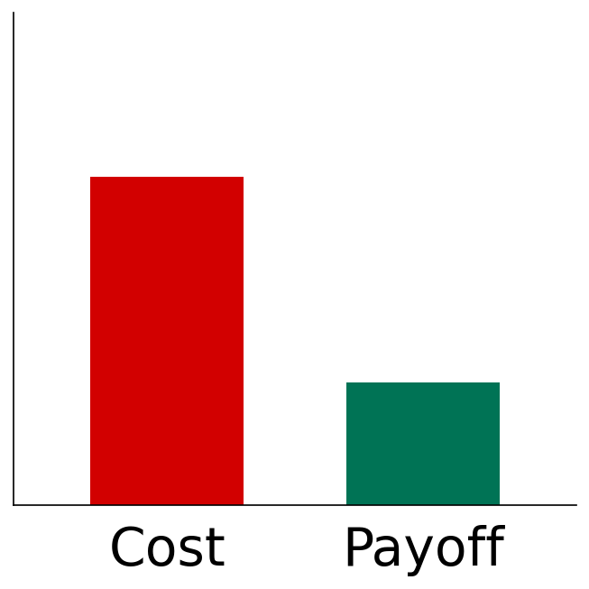
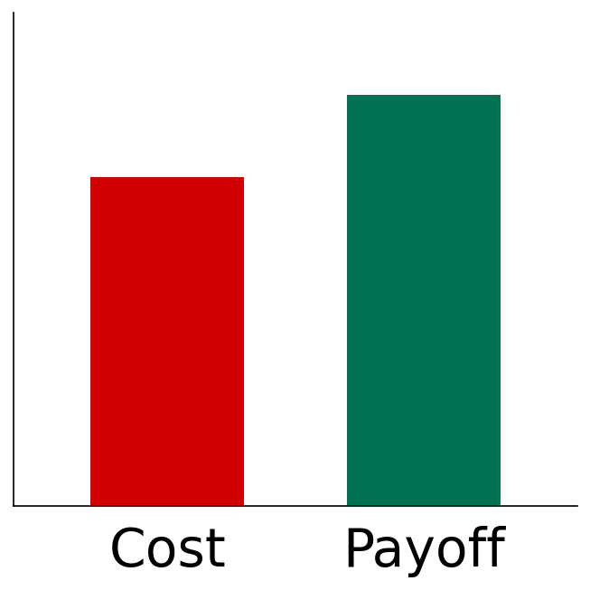
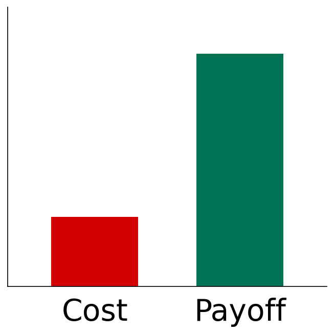
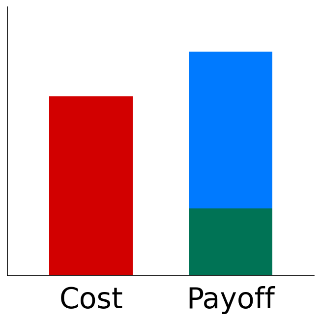
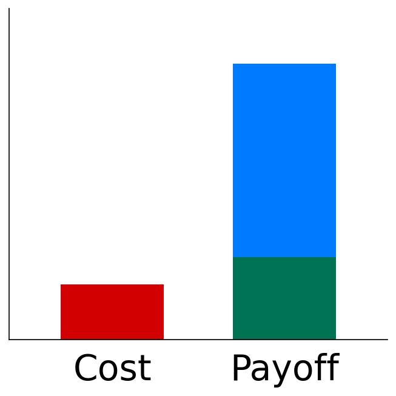
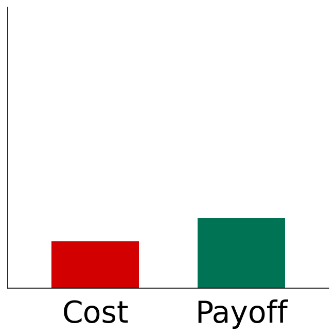

---
theme:
  path: ../../.presenterm/theme.yaml
options:
  list_item_newlines: 2
---

<!-- new_lines: 4 -->
<!-- alignment: center -->


**<span class="term">Lecture 01 — Introduction</span>**

Tools of the Trade
==================

- In any trade or profession, knowing your tools is **essential**.

Example: Carpentry
==================

<!-- list_item_newlines: 1 -->
- **Problems** faced by carpenters:
    - Drive a nail
    - Cut a board
    - Measure a piece of wood
<!-- list_item_newlines: 2 -->
- **Tools**: hammer, saw, tape measure, ...

Example: Carpentry
==================


Data Science
============

<!-- list_item_newlines: 1 -->
- **Problems** faced by data scientists:
    - Store code and data
    - Train massive models on other computers
    - Push models to production

<!-- list_item_newlines: 2 -->
- **Tools**: Git, Linux, cloud computing, Docker, ...

Data Science Toolkit
====================

<!-- list_item_newlines: 1 -->
- Over your career, you'll build your own toolkit.
    - Your most-used tools will become second nature.
    - You'll tailor them to fit *your* needs.
<!-- list_item_newlines: 2 -->
- In this class, we'll get you started.


<span class="bad">**Problem:**</span> Costs and Payoffs 
=========================================================

- Every tool has a <span class="bad">**cost**</span> and a <span class="good">**payoff**</span>.
- If <span class="bad">**cost**</span> > <span class="good">**payoff**</span>, you won't use the tool.
- If you don't use it, you won't learn it.
- If you don't learn it, the cost stays high.

Example: Git
============

- `git` is a <span class="term">**version control**</span> tool.
- It is **critical** for working on large projects.
- But for now you might be OK with:
<!-- column_layout: [1, 4, 1] -->
<!-- column: 0 -->
<!-- column: 1 -->
```bash
code-v1.py
code-v2.py
code-v2-bugfix.py
code-v3-final.py
code-actually-final.py
```
<!-- column: 2 -->
<!-- reset_layout -->


Example: Git
============

Right now, `git` probably has a high cost and low payoff for you.




Example: Git
============

When you start working on real projects, the code gets more complex, and the payoff increases.



<!-- pause -->

Since <span class="bad">**cost**</span> < <span class="good">**payoff**</span>,
this is when you'll start using and learning `git`.

Example: Git
============

As you learn it, the cost goes down, but the payoff stays high.



This Quarter
============

- We'll tie your use of the tools to a grade, so payoff (artificially) increases.



This Quarter
============

- As you get experience with the tools, the cost of using them goes down.



This Quarter
============

- After the quarter, the grade goes away — but the cost stays low.



Goal
====

> Reduce the cost of using the tools so much that you keep using (and learning) them after the quarter ends.

Lecture Format
==============

- You learn tools by using them.
- So lectures will have a little theory and a lot of hands-on practice.
- We'll cover the basics in demos during lecture, but you might need to read
  docs/explore on your own.
- Each lecture has a `YSK.md` ("You Should Know") file with the details of what
  you should take away.


AI
==

- AI is not a topic in this course.
<!-- pause -->
- It underlies *every* topic in this course.
<!-- pause -->
- AI coding agents (Claude Code, Codex) are incredibly powerful <span class="term">**meta-tools**</span>.
- You will need to use them to compete in the job market.
- We will use them **extensively**.


---

<!-- new_lines: 4 -->
<!-- alignment: center -->


**<span class="term">Syllabus</span>**

Website
=======

The course website is a GitHub repository:

> http://github.com/dsc-courses/dsc190-tools-2026-sp

All course materials will be posted in the repo.

The syllabus is in the repo as `SYLLABUS.md`.

Grading
=======

Your grade will be based on:

- 8 Quizzes (40%)
- 8 Assignments (40%)
- Final Project (20%)

Quizzes
=======

- Every Friday there will be a ~10 minute quiz on the material covered that week.
- Quiz questions will mostly require memorizing details of a tool's usage.
- Questions will be randomly drawn from a public bank of questions (the `YSK.md` files).
- I.e., all possible quiz questions are published ahead of time.

Example Quiz Question
=====================

> What does the "-r" in "rm -r" do?
>
>   A) Remove read-only files without prompting
    B) Remove directories and their contents recursively
    C) Rename files instead of removing them
    D) Reverse the most recent deletion

Quiz Redemption
===============

- Every quiz will have a "redemption quiz".
- Held the following week (also during Friday lecture).
- If you score higher on the redemption quiz, it replaces your original score.

But...
======

- Justin, I don't want to come to lecture *every Friday* just to take a quiz!
<!-- pause -->
- **Option 1**: Come every other Friday and take that week's quiz + previous week's redemption.
<!-- pause -->
- **Option 2**: "Too Cool for School". Instead of quizzes, you will take a comprehensive oral exam with me at the end of the quarter.
- You **must** let me know via email by the end of Week 2 if you want to do Option 2.

Lectures and Discussion
=======================

- Lectures will be on Monday and Wednesday. Attendance is optional.
- Friday are reserved for quizzes.
- We won't be using the discussion section.

DSC 190 v0.0.1
==============

- This is the first time this course is being taught.
- Eventually, might become a required course for the major.
- Your feedback will be very helpful!

---

<!-- new_lines: 4 -->
<!-- alignment: center -->


**<span class="term">The Unix Shell</span>**

Unix
====

- Unix is an operating system developed at AT&T Bell Labs, starting in **1969**.
- Today, it's derivatives (Linux, Android, macOS) power the **majority** of the world's computers.
- It's the platform of choice for software development and data science.
    - But why?

Surprise!
=========

- I have bought you all a Linux computer.
<!-- pause -->
- Well, I've *rented* you all a Linux computer.
- You should have received an email with your username/password for our course
  server.
- To connect, open a terminal and type:
<!-- alignment: center -->
`ssh <your-username>@172.235.41.44`

The Shell
=========

- What you are seeing is the <span class="term">**shell**</span>.
- It is a text-based <span class="term">**command-line interface**</span> for
  working with the computer.
- Via the shell, you can:
    - Manage files
    - Run programs
    - Connect programs together to run complex workflows
    - etc.

The Basics
==========

- Let's learn how to explore and manipulate the filesystem using the shell.

- A good supplemental resource:

<!-- alignment: center -->
https://swcarpentry.github.io/shell-novice/


Demo
====

- Time for Demo 01.
- `ls`: list files in the directory
- `cd <dir>`: change directory
- `less <file>`: view the contents of a file (`q` to quit)
- Tip: use the tab key for autocompletion!

Tips
====

Use the keyboard shortcuts!

<!-- list_item_newlines: 1 -->
- Up/down arrows: cycle through command history
- Ctrl-a / Ctrl-e: move to beginning/end of line
- Ctrl-u: delete from cursor to beginning of line
- Ctrl-w: delete previous word
- Alt-left/right: move cursor one word left/right

Note
====

- <span class="term">**Terminal**</span> and <span class="term">**shell**</span> are often used interchangeably, but they are **not** the same thing.
- The shell is the program that *interprets* your commands.
- The terminal is the program that *displays* the shell.
- Browser : Website :: Terminal : Shell

