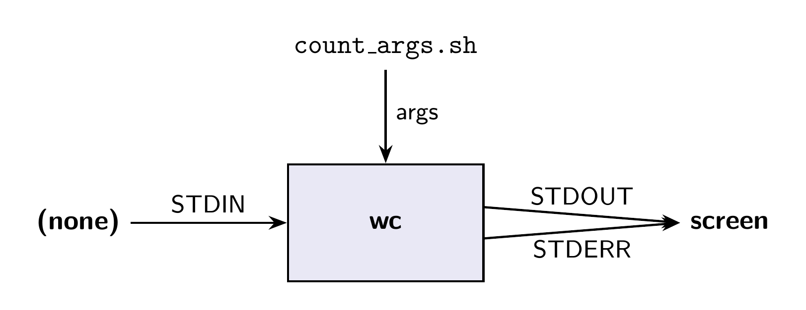
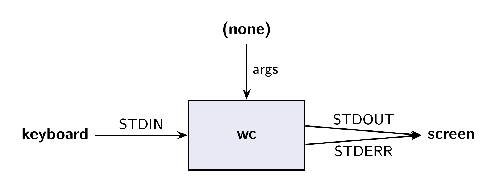
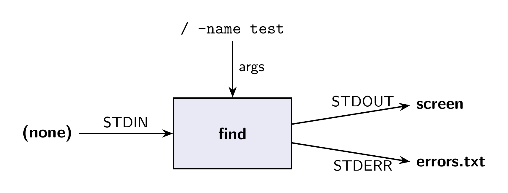
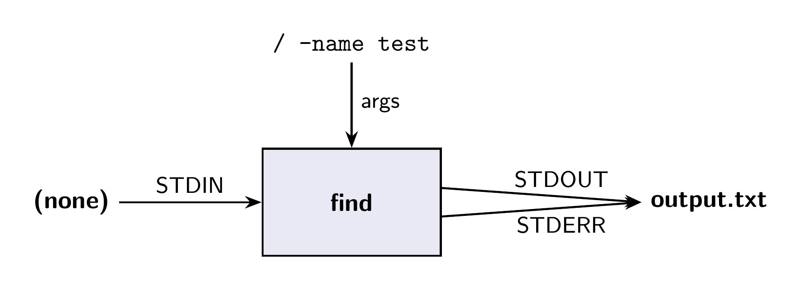

---
theme:
  path: ../../.presenterm/theme.yaml
  override:
    footer:
      style: template
      right: "{current_slide} / {total_slides}"
options:
  list_item_newlines: 2
---


Shell Features
==============

To follow along:

1. Run `bash start-linux.sh`.
2. `cd` into the course repository directory.
3. Run `git pull`.
4. Go to the first demo for Lecture 04:

```bash
demo 4 1
```

---

<!-- new_lines: 4 -->
<!-- alignment: center -->


**<span class="term">Editing Files</span>**

Editing in the Terminal
=======================

- Editing files in the terminal *can* be a pain.
- Usually, you'll edit files outside of the terminal (e.g., with VSCode).
- But sometimes, it's quickest and easiest to just edit the file right in the
  shell.

nano
====

- nano is a simple terminal text editor.
- Use it for quick edits to files.
```bash
nano <file>
```
<!-- list_item_newlines: 1 -->
- Bottom toolbar shows important keyboard shortcuts.
    - "^X" means "Ctrl-X"

<span class="exercise">**Exercise: demo 4 1**</span>
===

Edit the README.md and add a line that says "Hello world!".

Then save, quit, and use `less` to verify that your change was made.

VIM
===

- VIM is a much more powerful (and complex) terminal text editor that is pre-installed almost everywhere.
- But it has a (very) steep learning curve.
- For this class, you only need to know one thing about VIM: how to quit it.
    - Press `Esc` to make sure you're in "normal mode", then type `:q` and press Enter to quit.

---

<!-- new_lines: 4 -->
<!-- alignment: center -->


**<span class="term">Lecture 04 — Shell Features</span>**

Shell Features
==============

- The shell is an interface to the operating system.
- It's main job: help you run programs and work with files.
- Today, several convenience features:
    - Globbing and brace expansion
    - Variables
    - Command substitution
    - Pipes and redirection

---

<!-- new_lines: 4 -->
<!-- alignment: center -->


**<span class="term">Globbing, Expansion, and Quoting</span>**

<span class="term">**Globbing**</span>
===

- Globbing is a way to specify multiple files using patterns.
- *: matches any sequence of characters.
- ?: matches any single character.

```bash
# copy all CSV files to the backup directory
cp *.csv backup/

# copy all files of the form data_01.txt, data_02.txt,
# etc. to the backup directory
cp data_??.txt backup/

```

<span class="exercise">Exercise: demo 4 1</span>
===

This directory has some CSV files and some Python files.

1. Copy all of the CSVs to a `data/` directory.
2. Copy all of the Python files to a `scripts/` directory.
3. There are no text files, but try the following and see what happens:

```bash
cp *.txt data/
```

How does this work?
===================

- The shell <span class="term">**expands**</span> certain
special characters before running the command.

```bash
# you write:
cp *.csv data/

# this gets transformed into...
cp revenue.csv sales_q1.csv sales_q2.csv data/
```

Let's try it
============

- In the demo directory, run:
```bash
source count_args.sh
```
- This "installs" a "count_args" helper command that counts the number of args it receives and prints each on a new line.
- Try: count_args foo bar baz

<span class="exercise">Exercise: demo 4 1</span>
===

- Try each of:

```bash
count_args *.csv
count_args *
count_args *.txt
```

What's happening?
=================

- The shell is replacing the glob pattern with the list of files that match it **before** sending args to the program.
- This is called <span class="term">**expansion**</span>.
- Notes:
    - Not recursive. Only matches files in the current directory.
    - If no files match the pattern, the pattern is left unchanged.

Quoting
=======

- Quotes prevent expansion. Try:

```bash
count_args "*.csv"
```
- The program is passed the literal string "*.csv" instead of the list of CSV files.


<span class="exercise">Exercise: demo 4 1</span>
===

Compare these. Why does the first one succeed and the second one fail?
```bash
find . -name "*.csv"
```
```bash
find . -name *.csv
```

Answer
======

```bash
find . -name *.csv
```
Here, the shell expands "*.csv" before running "find". This is equivalent
to running:

```bash
find . -name revenue.csv sales_q1.csv sales_q2.csv ...
```

Answer
======

```bash
find . -name "*.csv"
```

Here, the shell is prevented from expanding "*.csv" because of the quotes.

Brace Expansion
===============

- Braces allow you to specify multiple options for a part of a command.
```bash
# make three directories
mkdir data_{1,2,3}

# this "expands" to
mkdir data_1 data_2 data_3
```

<span class="exercise">Exercise: demo 4 1</span>
===

Try:
```bash
count_args data_{1,2,3}
count_args data_{a,b}{1,2,3}
```

Quoting
=======

- Just like with globbing, quotes prevent brace expansion.

```bash
# three args
count_args data_{1,2,3}

# just one argument, the literal string "data_{1,2,3}"
count_args "data_{1,2,3}"
```

---

<!-- new_lines: 4 -->
<!-- alignment: center -->


**<span class="term">Variables</span>**

Variables
=========

- The shell supports variables.
- To set a variable, use `=` with no spaces:
```bash
name=Justin
number=42
greeting="Hello, world!" # quotes are important here
```

Referencing Variables
=====================

- To use the value of a variable, prefix it with `$`:
```bash
# echo is a program that prints its arguments
echo $number
echo $greeting
echo my name is $name
```

Variables and Quoting
=====================

- Variable references are also expanded by the shell.
- But quoting is a little more nuanced. Try:
```bash
x='This is a test'
count_args $x
count_args "$x"
count_args '$x'
```

What we found...
================

- **Unquoted**: substitute and split on whitespace.
- **Double quotes**: substitute, but don't split.
- **Single quotes**: don't substitute, don't split.

Variables are just strings
==========================

- The shell doesn't have types. Variables are always strings.

```bash
x=42

# prints "42 + 1", not "43"
echo $x + 1
```

---

<!-- new_lines: 4 -->
<!-- alignment: center -->


**<span class="term">Command Substitution</span>**

Command Substitution
====================

- The shell also allows you to use the output of one command as an argument to another.
- Syntax: `$(command)`

```bash
# prints the current date in YYYY-MM-DD format
date +%Y-%m-%d

# make a directory with the current date in its name
mkdir data_$(date +%Y-%m-%d)
```

Command Substitution and Variables
==================================

- Command substitution can be used to set variables too:

```bash
today=$(date +%Y-%m-%d)
echo "Today's date is $today"
```

Command Substitution and Quoting
================================

- Same rules as with variables.
- Usually, you want double quotes to prevent word splitting.

```bash
mkdir "data_$(date)"
```

---

<!-- new_lines: 4 -->
<!-- alignment: center -->


**<span class="term">I/O Streams, Pipes and Redirection</span>**

It's all text...
================

- Command line programs take *text* as input and produce *text* as output.


The `wc` Command
================

- `wc` (word count) is a command that counts lines, words, and characters.

```bash
# count lines, words, and characters in count_args.sh
wc count_args.sh
```

The `wc` Command, Without Arguments
===================================

- If you run `wc` without any arguments, it looks like it's not doing anything.
- But actually, it's waiting for you to type some text.
- Type a line or two.
- To signal that you're done, enter a new line and press Ctrl-D.

I/O Streams
===========

- When you run a program, the shell connects three text "streams" to it:
    - **Standard input** (stdin). Default: keyboard (or unused).
    - **Standard output** (stdout). Default: terminal output.
    - **Standard error** (stderr) Default: terminal output.
- It also provides arguments.

Example
=======

```bash
wc count_args.sh
```



Example
=======

```bash
wc
```



Pipe
====

- We can attach the **output** of one program to the **input** of another using a pipe (`|`):

```bash
# pipe the output of "ls" to "wc"
# counts number of files in directory
ls | wc -l
```

Example
=======

```bash
ls | wc -l
```


Grep in a Pipe
==============

- grep is especially useful in a pipe.

```bash
# print all running processes
ps aux

# is python running?
ps aux | grep python
```

Example
=======

```bash
# sort the results of find and look at them in less
find . -name "*.csv" | sort | less
```

Output Redirection
==================

- The `>` operator redirects the STDOUT to a file instead of the terminal.
- If the file already exists, it will be overwritten.

```bash
# save the list of CSV files to a text file
find . -name '*.csv' > files.txt
```

Example
=======

```bash
# save the list of CSV files to a text file
find . -name '*.csv' > files.txt
```


Output Redirection, Append Mode
===============================

- The `>>` operator also redirects STDOUT to a file, but it appends to the file instead of overwriting it.

```bash
# append the list of Python files to the same text file
find . -name '*.py' >> files.txt
```

Redirecting Standard Error
==========================

- The `2>` operator redirects STDERR to a file.

```bash
# search the whole filesystem, showing lots of
# permission denied errors
find / -name test

# redirect the errors to a file
find / -name test 2> errors.txt

# redirect the errors to an endless void
find / -name test 2> /dev/null
```

Example
=======

```bash
find / -name test 2> errors.txt
```



Redirecting Both
================

- To redirect both STDOUT and STDERR to the same file, you can use `&>`:

```bash
# send both results and error messages to the same file
find / -name test &> output.txt
```

Example
=======

```bash
find / -name test &> output.txt
```



The UNIX Philosophy
===================

- "Do one thing and do it well."
- "Write programs that work together."
- "Write programs to handle text streams, because that is a universal interface."

The Result
==========

- If each program can "speak" to the others, it's easy to combine them in powerful ways.
