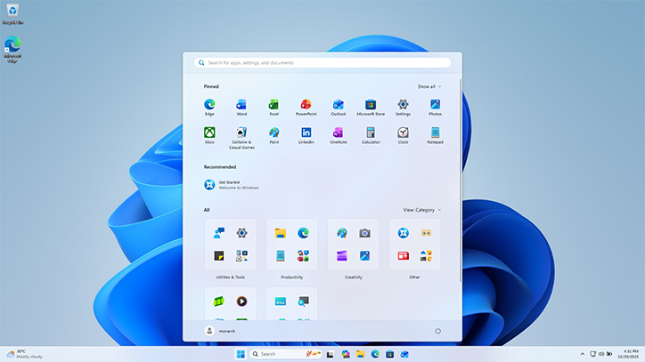

---
theme:
  path: ../../.presenterm/theme.yaml
  override:
    footer:
      style: template
      right: "{current_slide} / {total_slides}"
options:
  list_item_newlines: 2
---


Virtual Environments and Agents
================================

To follow along:

1. Run `bash start-linux.sh`.
2. `cd` into the course repository directory.
3. Run `git pull`.
4. Go to the first demo for Lecture 06:

```bash
demo 6 1
```

---

<!-- new_lines: 4 -->
<!-- alignment: center -->


**<span class="term">Python Virtual Environments</span>**

Python Dependencies
===================

- Suppose we need a package (numpy) that is not installed.
- How should we install it?

One answer: pip
===============

- `pip` is the standard Python package manager.
- To install a package, run:
```bash
# in the shell
pip install numpy
```
<!-- pause -->
- This is generally a <span class="bad">**bad idea**</span>.

Why?
====

- By default, pip installs packages *globally*.
    - i.e., into the system's Python directory (e.g., `/usr/lib/python3/dist-packages`).
- Result: all of your Python projects will share this same version of numpy.

The Version Problem
===================

- Over time, packages make backwards-incompatible changes.
- Example: older versions of `numpy` had a `np.in1d` function, but it was removed in numpy v2.0.
- Result: older projects need a different version of numpy than newer projects.
    - They can't share the same version.

Solution
========

- Give each project its own Python <span class="term">**virtual environment**</span>.
- This allows each to have its own packages.

Creating a Virtual Environment
==============================

- To create a virtual environment, run (in your project's directory):

```bash
python3 -m venv <env-name>
```

Activating a Virtual Environment
================================

- To use the virtual environment, you need to "activate" it:

```bash
source <env-name>/bin/activate
```

- To deactivate the virtual environment, run:

```bash
deactivate
```

<span class="exercise">**Exercise: demo 6 1**</span>
===

In the demo is a directory named "old-project".

In this directory, create a virtual environment named "env", then activate it.

How did $PATH and Python's `sys.path` change?

How it works...
===============

- Virtual environments work by modifying the $PATH and Python's `sys.path` variables when activated.
- When you deactivate, it restores them to their original values.

Installing into a Virtual Environment
=====================================

- To install a package into a virtual environment, first activate the environment, then run pip as normal:

```bash
source env/bin/activate
pip install numpy
```

Versions
========

- To install a specific version:
```bash
# with the virtual env activated...
pip install numpy==1.23
```


<span class="exercise">**Exercise: demo 6 1**</span>
===

Install numpy version 1.23 into old-project's virtual environment.

Run python, import numpy, and check the numpy's `__version__` and `__path__` attributes.

<span class="exercise">**Exercise: demo 6 1**</span>
===

Create a separate virtual environment for the "new-project" directory, and
install the latest version of numpy into it.

My Take
=======

- Always, *always* use virtual environments.
- However, we typically will not use `python -m venv` directly.
- We will see a better way (uv) in a coming lecture.

Why?
====

Creating virtualenvs this way has some deficiencies:

- It is hard to share the environment with others.
- It is slow.

uv fixes these problems, and is the recommended way to manage Python environments in 2026.


---

<!-- new_lines: 4 -->
<!-- alignment: center -->


**<span class="term">Why UNIX/Linux?</span>**

Why UNIX/Linux?
===============

- This concludes our focus on the UNIX shell.
- There is a lot more to it; we'll pick up anything else we need along the way.
- But first: why do we *still* use this ancient technology?


A Graphical Shell
=================



Why?
====

- Why do we still use the command line, when we have GUIs?
- **Answer**: automation.
    - Command-line tools are easier to *script* and *automate* than GUIs.
    - They are *designed* to be used together.

Example
=======

Suppose: every day you need to run an analysis:
1. Create a new directory for the day's data.
2. Download the data into that directory.
3. Run a Python script to analyze the data.
4. Copy the results to a shared folder.

Example
=======

```bash
# run-analysis.sh
mkdir data-$(date +%Y-%m-%d)
cd data-$(date +%Y-%m-%d)
wget https://example.com/data.csv
python /path/to/analyze.py data.csv
cp results.txt /path/to/shared/folder/
```

Example
=======

- It is not *impossible* to do this within a graphical shell.
- But it is harder.
- **GUIs** are for humans.
- **CLIs** are for humans *and* machines.

We'll Prefer CLIs
=================

- Often, tools will have *both* a CLI and a GUI.
    - Example: git
- There's no *shame* in using the GUI (it's often easier).
- But in this class, we'll often focus on the CLI *because* it is scriptable.


We will see...
==============

- AIs love UNIX command-line interfaces.

---

<!-- new_lines: 4 -->
<!-- alignment: center -->


**<span class="term">The Rest of the Quarter</span>**

The Rest of the Quarter
=======================

- We have a lot more tools to learn:
    - git, Docker, uv, etc.

- We will use all of these tools through the UNIX shell.
    - UNIX is the "foundation" for all of these tools.

Stepping out of the Container
=============================

- We have been using the UNIX shell through the Docker container.
    - bash start-linux.sh
    - This was so we had a common environment.
- But working in a container is restrictive.
    - It is isolated from the rest of your computer (by design).

UNIX at Home
============

- You can use the UNIX shell on your own computer, without a container.
    - macOS: based on UNIX.
    - Windows: WSL2 (Windows Subsystem for Linux).
- Part of this week's assignment will be to set up a UNIX environment on your own machine.

Structure
=========

- Every tool has a purpose.
    - Knowing *why* and *when* to use a tool is as important as knowing *how*.
- So, we will learn the tools in the context of two **case studies**.

Case Study 1: A Python CLI Program
==================================

- We will build a CLI program in Python.
    - A vanilla "software engineering" project.
- This will introduce version control (git), python package management (uv), python tooling (ruff, mypy, pytest), and more.

Case Study 2: A Data Science Project
====================================

- We'll carry out a data science project.
    - Exploratory analysis, model training, etc.
- This will introduce data version control (DVC), notebook interfaces (marimo), result publication (quarto, LaTeX, typst), dashboards (streamlit), model deployment (fastapi, Docker), etc.

---

<!-- new_lines: 4 -->
<!-- alignment: center -->


**<span class="term">AI</span>**

AI
==

- We have been using an AI agent via `OpenCode` in the container.
- Now that we are moving out of the container, we'll need to set up AI tools on our own machines.
- This week's assignment guides you through that process.

<span class="bad">**DANGER**</span>
===

- Giving AI unrestricted access to your computer is a <span class="bad">**bad idea**</span>.
- What can go wrong?

Problem 1: Data Loss
====================

- AI agents still hallucinate and make mistakes.
- Only now, they can also run `rm -rf` and delete all of your files.
- e.g., [Claude Code deleted my entire 202GB archive...](https://www.reddit.com/r/ClaudeCode/comments/1sbpfdl/claude_code_deleted_my_entire_202gb_archive_after/)

Problem 2: Data Exfiltration
============================

- An unrestricted AI agent can read any file on your computer.
- It can then send that data to a remote server.
- Prompt injection:
    - An attacker includes a malicious prompt within otherwise innocuous data (e.g., a website).
    - The AI dutifully follows the malicious instruction.

The Key: *Unrestricted Access*
==============================

- These dangers arise if you give the AI *unrestricted* access to your computer.
- You should always tightly control what an AI agent can do.
- How?

Containers
==========

- There was no concern with OpenCode inside of our Docker container.
- The container was *isolated* from the rest of our computer.
    - The AI could have deleted or exfiltrated the container files, but so what?
- People do use Docker containers to isolate their agents.

Docker Sandboxes
================

- There is a more convenient approach: Docker sandboxes.
- One command:
```bash
sbx run opencode
```

- Creates a container, installs opencode, and shares your current directory (and only that directory) with the container.

Docker Sandboxes
================

- If you use a Docker sandbox, the agent can only read and write files in the project directory.
    - It could still delete them.
    - It could still exfiltrate information within that directory.

Recommendation
==============

- For now, **always** run agents within a Docker sandbox.
- This week's assignment guides you through setting them up.
- Later, we'll use learn about more *lightweight* sandboxing tools.

Next Time...
============

- git
