---
theme:
  path: ../../.presenterm/theme.yaml
options:
  list_item_newlines: 2
---


Git
===

To follow along...

1. Download and run [Fork](https://git-fork.com), a Git GUI.
2. Open a terminal, `cd` to a place where you want to work.
    - E.g., your desktop on macOS, or your home directory in WSL.

You should not use the Docker container.

---

<!-- new_lines: 4 -->
<!-- alignment: center -->


**<span class="term">Git Basics</span>**

Git
===

- Git is a **version control system** (VCS).
- It gives you two new, important capabilities:
    - **Time machine**: You can go back to any previous version of your project files (code, data, etc.)
    - **Parallel universes**: you can work on multiple versions of your project and merge them together when you're done.
        - This allows *collaboration*.

Learning Git
============

- Git is a command line tool.
- But there are many Git GUIs.
- We'll use both.


<span class="exercise">**Exercise**</span>
===

With Fork:
- Create a new <span class="term">**repository**</span>.
- Create and modify some files, <span class="term">**stage**</span> and <span class="term">**commit**</span> the changes.

<!-- pause -->

Now do the same with the CLI.

Git CLI Basics (Staging and Committing)
=======================================

- `git init`
    - create a new Git repo in the current directory.
- `git add <file>`
    - stage a file for commit.
- `git commit`
    - commit the staged files.
- `git commit -m "message"`
    - commit with a message.

Git CLI Basics (Status)
=======================

- `git status`
    - shows the status of your files.
- `git log`
    - shows the commit history.

**Tip**: Git GUIs make it easier to see the git history.

---

<!-- new_lines: 4 -->
<!-- alignment: center -->


**<span class="term">Git Basics (Undoing Changes)</span>**

Undoing Changes
===============

Git allows you to "undo" changes.

- Accidentally staged a file?
    - Unstage it.
- Want to discard all changes?
    - Restore the file to the last committed version.
- Want to undo a commit?
    - Revert it.

<span class="exercise">**Exercise**</span>
===

With Fork (and then with the CLI):
- Unstage a file.
- Discard all changes to a file.
- "Undo" a commit by <span class="term">**reverting**</span> it.


Git CLI Basics (Undoing)
========================

- `git restore --staged <file>`
    - unstage a file.
- `git restore <file>`
    - discard all changes to a file.

<span class="exercise">**Exercise**</span>
===

Oops! You accidentally your whole project by running `rm -rf` inside the project directory.

How do you recover from this?

Going way back...
=================

- Suppose you want to restore a previous version of a file from a (much)
  earlier commit.

1. Find the commit hash of the commit you want to restore from.
2. Run:
```bash
git restore --source <commit-hash> <file>
```

Tip
===

- Browsing earlier commits is easier with a Git GUI.

<span class="exercise">**Exercise**</span>
===

Restore `README.md` from the first commit.

---

<!-- new_lines: 4 -->
<!-- alignment: center -->


**<span class="term">Basic Git Theory</span>**

Three Trees
===========

- Git works by using three "file trees" ("virtual" directories) to keep track of your files.
- Most git commands manipulate these trees in some way.

1. <span class="term">**Working tree**</span>: the files in your project directory.
2. <span class="term">**Staging area**</span> (virtual): the files as they were when you staged them.
3. <span class="term">**HEAD**</span> (virtual): the files as they were in the last commit.

---


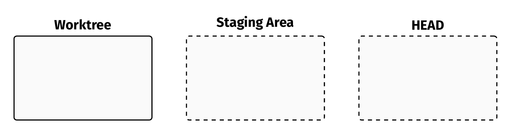

---


Before:
```bash
# create a new file
touch README.md
```

---

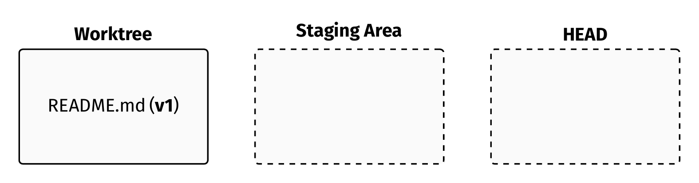

After:
```bash
# create a new file
touch README.md
```

---


Before:
```bash
# stage README.md
git add README.md
```

---

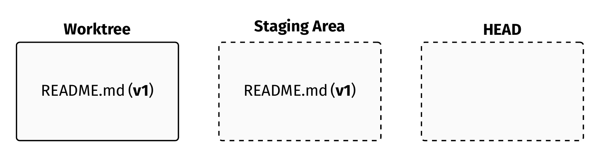

After:
```bash
# stage README.md
git add README.md
```

---


Before:
```bash
git commit -m "Add README."
```

---

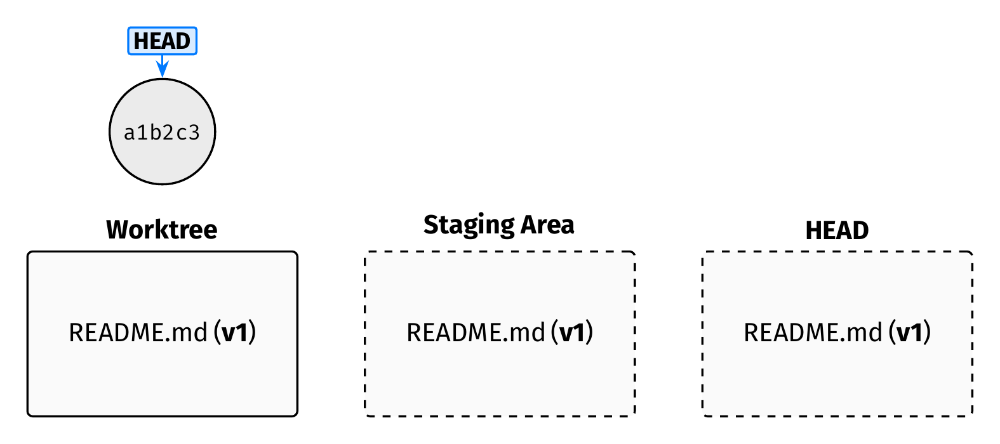

After:
```bash
git commit -m "Add README."
```

---


Before:
```bash
# create a new file
touch main.py
```

---

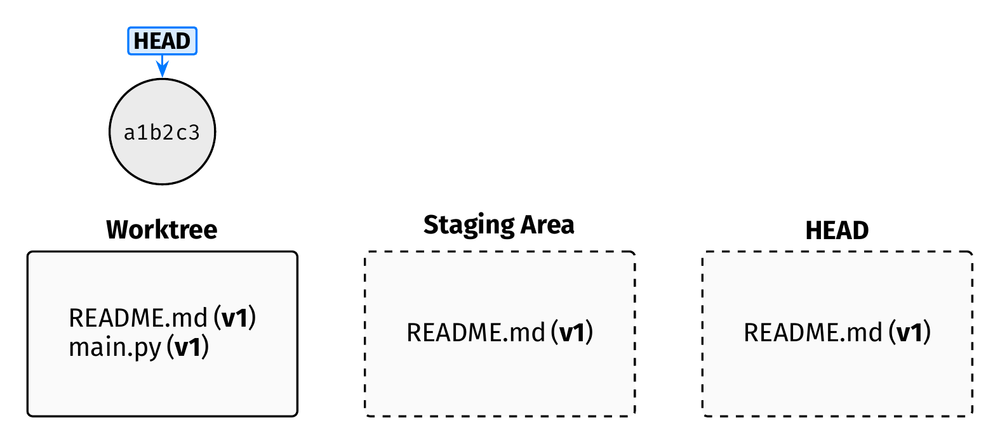

After:
```bash
# create a new file
touch main.py
```

---


Before:
```bash
# stage main.py
git add main.py
```

---

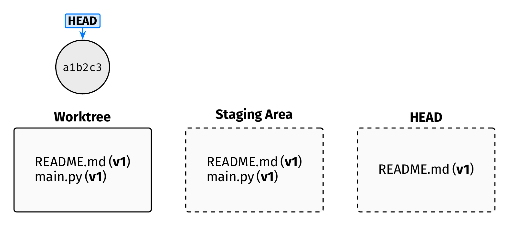

After:
```bash
# stage main.py
git add main.py
```

---


Before:
```bash
git commit -m "Add main.py."
```

---


After:
```bash
git commit -m "Add main.py."
```

---


Before:
```bash
# append to the files
echo "hello" >> README.md
echo "print('hi')" >> main.py
```

---

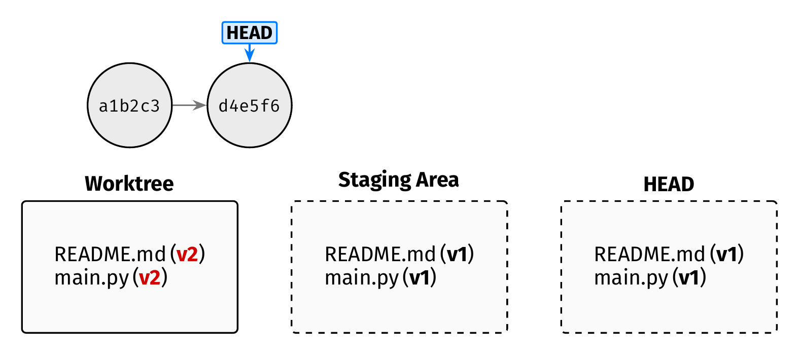

After:
```bash
# append to the files
echo "hello" >> README.md
echo "print('hi')" >> main.py
```

---


Before:
```bash
# stage README.md (but NOT main.py!)
git add README.md
```

---

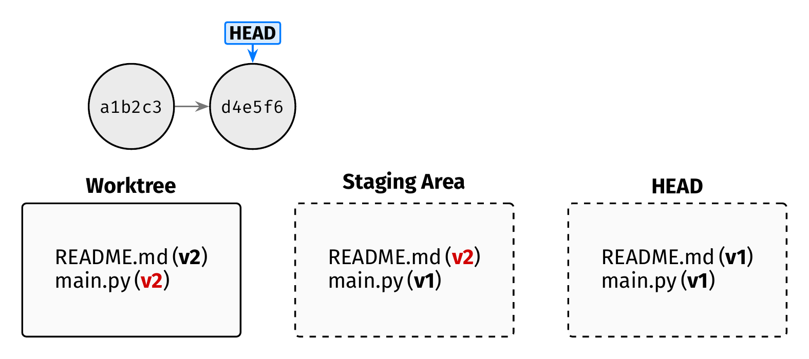

After:
```bash
# stage README.md (but NOT main.py!)
git add README.md
```

---


Before:
```bash
git commit -m "Update README."
```
---

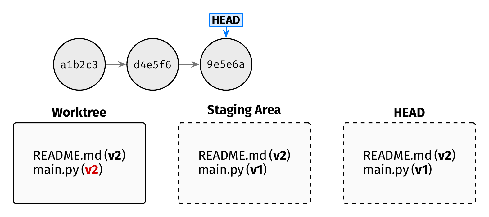

After:
```bash
git commit -m "Update README."
```

---


Before:
```bash
git restore main.py
```

---


After:
```bash
git restore main.py
```

`git add <file>`
================

- Copies the current content of `<file>` into the <span class="term">**staging area**</span>.
- <span class="term">**HEAD**</span> is unchanged.

`git commit`
============

- Saves the current <span class="term">**staging area**</span> as a new commit.
- <span class="term">**HEAD**</span> advances to point at this new commit.
- The <span class="term">**worktree**</span> is unchanged.

`git restore`
=============

- `git restore --staged <file>`
    - Copies `<file>` from <span class="term">**HEAD**</span> into the <span class="term">**staging area**</span>.
    - Effect: un-stages `<file>`.
- `git restore <file>`
    - Copies `<file>` from the <span class="term">**staging area**</span> into the <span class="term">**worktree**</span>.
    - Effect: discards <span class="term">**worktree**</span> changes to `<file>`.

---


---


Before:
```bash
# append to README.md
echo "more" >> README.md
```

---


After:
```bash
# append to README.md
echo "more" >> README.md
```

---


Before:
```bash
# stage README.md
git add README.md
```

---

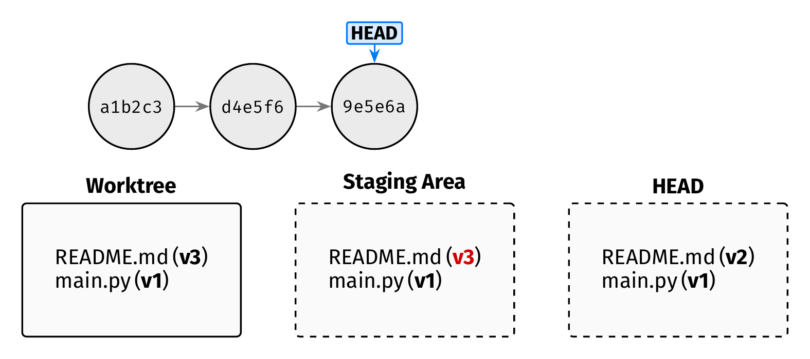

After:
```bash
# stage README.md
git add README.md
```

---


Before:
```bash
# append to README.md again
echo "even more" >> README.md
```

---

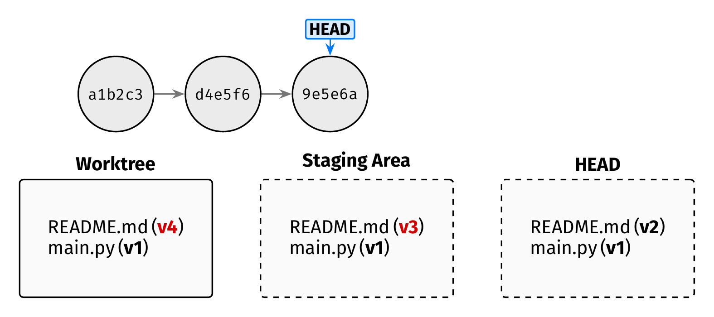

After:
```bash
# append to README.md again
echo "even more" >> README.md
```

---


Before:
```bash
# discard worktree changes to README.md
git restore README.md
```

---


After:
```bash
# discard worktree changes to README.md
git restore README.md
```

---


Before:
```bash
# unstage README.md
git restore --staged README.md
```

---


After:
```bash
# unstage README.md
git restore --staged README.md
```

---


Before:
```bash
# discard worktree changes to README.md
git restore README.md
```

---

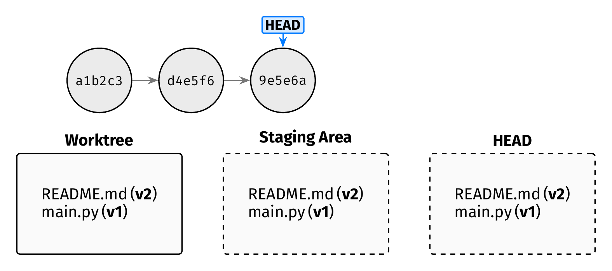

After:
```bash
# discard worktree changes to README.md
git restore README.md
```

---


Before:
```bash
# restore README.md from the first commit
git restore --source a1b2c3 README.md
```

---

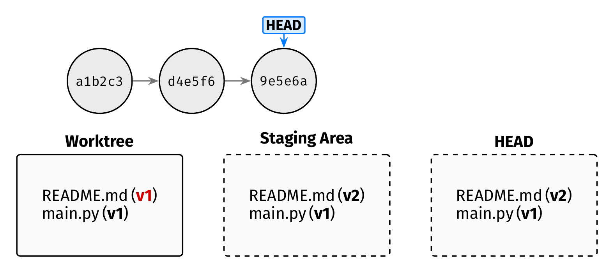

After:
```bash
# restore README.md from the first commit
git restore --source a1b2c3 README.md
```

---


Before:
```bash
# stage README.md
git add README.md
```

---

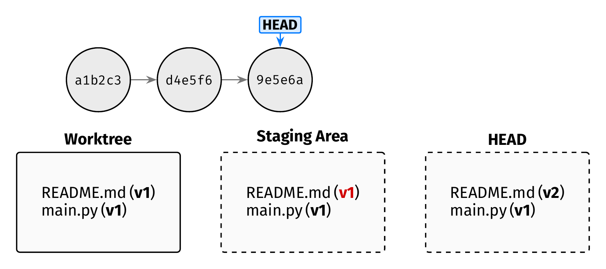

After:
```bash
# stage README.md
git add README.md
```

---


Before:
```bash
git commit README.md -m "Revert README to first commit."
```

---

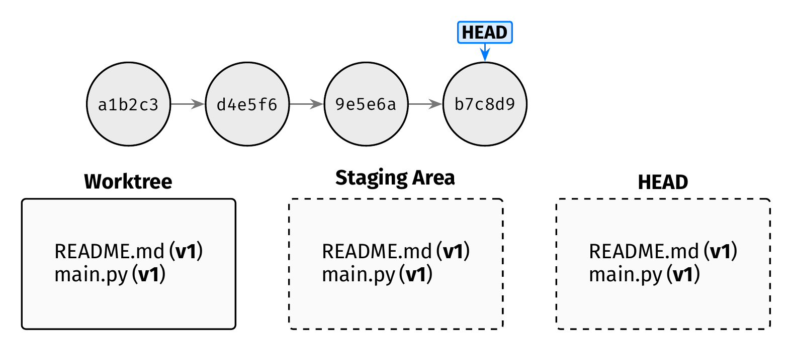

After:
```bash
git commit README.md -m "Revert README to first commit."
```

---


Before:
```bash
# oops! delete everything in the worktree
rm -rf *
```

---

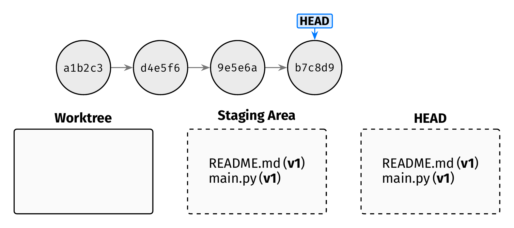

After:
```bash
# oops! delete everything in the worktree
rm -rf *
```

---


Before:
```bash
# restore all files from the staging area
git restore .
```

---


After:
```bash
# restore all files from the staging area
git restore .
```

For more details...
===================


- The [Pro Git Book](https://git-scm.com/book/en/v2).
- **Note**: we're learning *modern* Git.
    - Some commands, like "git restore" are new (better) replacements for older commands, like "git reset".
