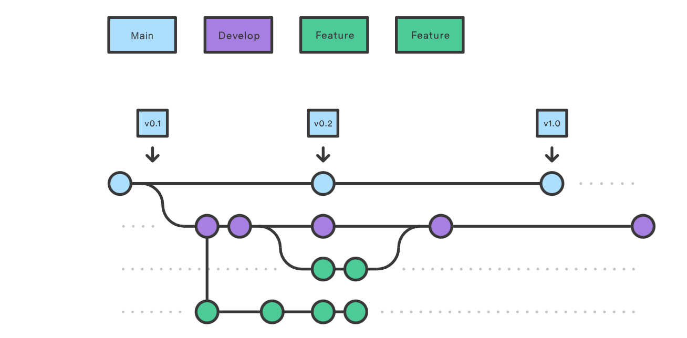
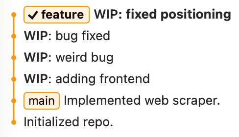
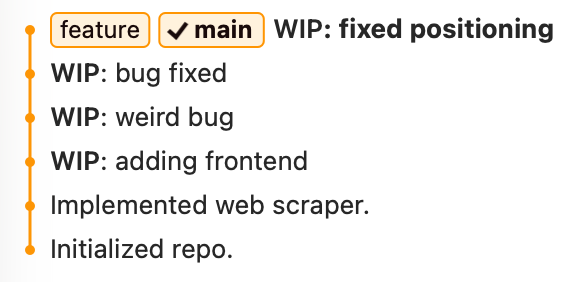
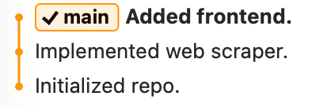

---
theme:
  path: ../../.presenterm/theme.yaml
  override:
    footer:
      style: template
      right: "{current_slide} / {total_slides}"
options:
  list_item_newlines: 2
---


Git in Practice
===============

To follow along...

1. Download and run [Fork](https://git-fork.com), a Git GUI.
2. Open a terminal, `cd` to a place where you want to work.
    - E.g., your desktop on macOS, or your home directory in WSL.

You should not use the Docker container.

---

<!-- new_lines: 4 -->
<!-- alignment: center -->


**<span class="term">Git in Practice</span>**

Git in Practice
===============

- We've learned the "low-level" basics of git.
- **Today**: high-level best practices for using git in real projects.

---

<!-- new_lines: 4 -->
<!-- alignment: center -->


**<span class="term">What should I commit?</span>**

Less is More
============

- You can commit any type of file to Git.
- But just because you *can* doesn't mean you *should*.

Reason 1: some files don't belong, conceptually
===============================================

- Some files in your project directory aren't really *part* of your project.

```text
my-python-project/
  .git/
  .ipynb_checkpoints/
  venv/
  __pycache__/
  .DS_Store
  main.py
  explore.ipynb
  my_notes.md
```

Litmus Test
===========

- Every file you commit should be necessary for someone else to understand, run, or modify your project.

Reason 2: some files don't belong, practically
==============================================

- Some types of files don't work well with Git.
    - In particular, large files and non-text files.
- Avoid committing large data sets, generated files, etc.

Why?
====

- Git stores a copy of very version of every file you commit.
- Text files are small, so this is usually not a problem.
- Keeping many versions of image files, PDFs, large data sets, etc. quickly starts to take up *lots* of space.
- Git operations (like `git status`) become very slow.

Corollary
=========

- Avoid committing files that are easily *reproducible*.
    - e.g., PDFs generated from LaTeX, Python virtual environments, files that can easily be downloaded.
- These files take up space and slow git, but have little marginal value.

Solution
========

- Versions of these files *should* still be tracked, but not by Git.
- We will discuss how to do this in a future lecture using *DVC*.

Ignoring Files
==============

- Git provides a way to **ignore** files that you don't want to commit.
- I.e., commands like `git status` and `git add .` will ignore these files.
- This is done using a special file called `.gitignore`.
    - Usually at the root of your project.

.gitignore format
=================

- Each line is a pattern that matches files to ignore.
- Can use wildcards (`*`).

Example `.gitignore`

```.gitignore
venv/
.ipynb_checkpoints/
__pycache__/
*.pdf
```

Generating a .gitignore
=======================

- Many editors and git GUIs (including Fork) can generate a `.gitignore` for you.
    - Contents should depend on the programming language being used.
- Can also use online generators, e.g., https://www.toptal.com/developers/gitignore.
    - Also provides a command-line tool, "gi", that generates a `.gitignore`.

Tip
===

When starting any new project, the first steps are often:

1. Create a new Git repository.
2. Generate a `.gitignore` file.


Caveat
======

- These are all rules of thumb.
- They are not laws.
- If you do break a "rule", be able to explain why.

<span class="bad">**Warning!**</span>
=======

- Deleting a file does **not** remove it from Git's history.
- If you accidentally commit a large file (or worse: a password / key), it's still
  in the repo even after deleting it from the worktree.
- You need to edit Git history to remove it.
    - Kind of a pain.
    - Helper tools exist, like git-filter-repo.
- If the repository was ever public, assume that any passwords/keys have been compromised and need to be changed.


---

<!-- new_lines: 4 -->
<!-- alignment: center -->


**<span class="term">Git Workflow for Solo Projects</span>**

Git Workflows
=============

- Git is very flexible in how it is used.
- A lot of choices are left up to the user:
    - How often to commit, when to branch, how often to merge, etc.
- Your employer will likely ask you to follow a specific <span class="term">**Git workflow**</span>.

Git Flow
========

A classic workflow for large software projects is called "Git Flow".



From: https://www.atlassian.com/git/tutorials/comparing-workflows/gitflow-workflow

A More Practical Workflow
=========================

- Git Flow is overkill for most data science projects.
- Now: a simpler recommend workflow for solo projects.

Rule #1: `main` should always be "clean"
========================================

- The `main` branch should always be in a "good" state.
    - E.g., the code should run without errors.
- Commits to `main` should be infrequent and deliberate.
- Commit messages should be meaningful.

Rule #2: do all work in branches
================================

- Don't do any work directly on `main`.
- Create a new <span class="term">**feature branch**</span> for each task/feature/experiment.
- Give the branch a descriptive name.
    - e.g., `add-data-cleaning`, `try-new-model`, etc.
- Feature branches can be messy: the code doesn't have to run.
- When the work is done, merge the branch back into `main` and delete it.

Rule #3: commit early, commit often
===================================

- Commits to the feature branches should be frequent.
- Utilize "Work in Progress" (WIP) commits.
    - Should have low barrier to committing.
    - Commit messages can be lazy, vague
    - Messages usually start with "WIP:"

<span class="bad">**Problem**</span>
===

- "main" should be clean, but feature branches can be messy.
- But if we merge a messy branch into main, then main becomes messy.


Before Merging
==============



After: Regular Merge
====================

```bash
git switch main
git merge feature
```



Solution: Squash Merge
======================

- A <span class="term">**squash merge**</span> combines all commits from a branch into a single commit.

```bash
git switch main
git merge --squash feature
git commit -m "Add data cleaning"
git branch -D feature # note: need to force delete
```

After: Squash Merge
===================



Downside
========

- Those WIP commits are now lost.
- That's usually not a problem if they were really just WIP commits.
- But you have lost information in order to gain a cleaner history.

Advantages
==========

- This simple workflow amounts to:
    1. Do all of your work on messy branches.
    2. Squash merge them into a clean main branch.

- Why is it important to have a clean main branch?


Example
=======

The main branch has your company's live website.

Your manager asks you to pivot the website, making sweeping changes over months.

In the middle of these changes, you discover a typo in the live site.

Example
=======

You've discovered a bug in your code that has apparently been live for months.

It's unclear what the source of the bug is. Which commit introduced it?

We can use *git bisect* to find it, but it will be much easier if the history is clean and well-organized.

---

<!-- new_lines: 4 -->
<!-- alignment: center -->


**<span class="term">Git Workflows for Team Projects</span>**

Workflows for Team Projects
===========================

- The workflow we described above also works for team projects, with a few modifications.

GitHub
======

- When working collaboratively, you will often use GitHub to host your repository.
- GitHub provides collaboration and communication features around a git repo.
- The workflow recommended by GitHub is called **GitHub Flow**[^1].

[^1]: See
https://docs.github.com/en/get-started/using-github/github-flow

Pull Requests
=============

- Like before:
    - main is always "clean".
    - All work is done in feature branches.
- But merging is done via a <span class="term">**pull request**</span> (PR).
- Pull requests are discussion threads around a proposed change to the code.


Submitting a PR
===============

1. Create a new branch locally and commit your changes.
2. When ready, push the branch to GitHub.
3. On GitHub, open a pull request from your branch to main.


Demo
====

Create a new pull request and merge it.


Why?
====

- Merging something into main is a big deal, especially if main is "live".
- A PR gives an opportunity for your colleagues/boss to review it first.
