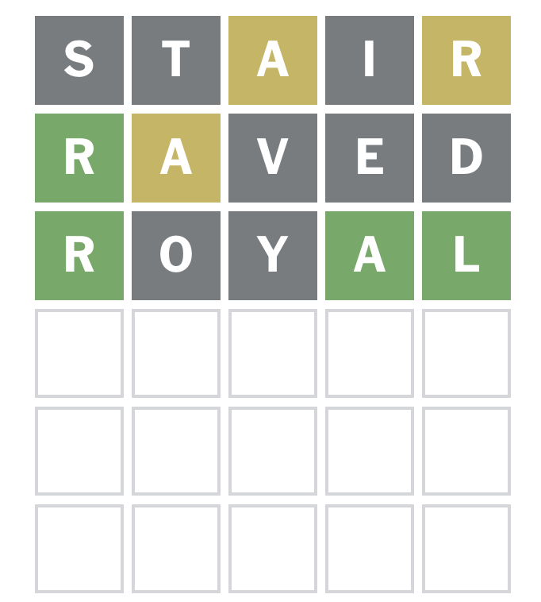

---
theme:
  path: ../../.presenterm/theme.yaml
  override:
    footer:
      style: template
      right: "{current_slide} / {total_slides}"
options:
  list_item_newlines: 2
---


MyPy and Pytest
===============

To follow along, clone the course repo:

```bash
git clone https://github.com/dsc-courses/dsc190-tools-2026-sp.git
```

---

<!-- new_lines: 4 -->
<!-- alignment: center -->


**<span class="term">More Python Tooling</span>**

More Python Tooling
===================

- Last time:
    - `uv` for project management
    - `ruff` for linting and formatting
- Today:
    - `mypy` for type checking
    - `pytest` for testing

Types in Java
=============

- Some languages, like Java and C++, require you to specify the type of each variable (e.g. `int`, `str`, `float`).

```java
// java
public int add(int a, int b) {
    return a + b;
}
```

- <span class="good">**Advantage**</span>: the *compiler* can catch errors before the code is run.

```java
// java
add(3, "hello"); // compile-time error: incompatible types
```

Types in Python
===============

- In Python, you don't need to specify types.

```python
# python
def add(a, b):
    return a + b
```

- <span class="good">**Advantage**</span>: more flexible and faster to write.

```python
add(3, 4)               # works, returns 7
add("hello", "world")   # works, returns "helloworld"
```

- Sometimes called <span class="term">**duck typing**</span>.

Types in Python
===============

- <span class="bad">**Disavantage**</span>: errors might only be caught at runtime.

```python
add(3, "hello")  # runtime error: TypeError: unsupported operand types
```

- <span class="bad">**Disavantage**</span>: harder to understand what types a function expects and returns.

```python
def compute_grade(student, scores, policy):
    # what are student, scores, and policy?
    # what type does this function return? A letter grade? A percentage?
    ...
```

Type Hints
==========

- While you don't *need* to specify types in Python, you *can* using <span class="term">**type hints**</span>.

```python
def add(a: int, b: int) -> int:
    return a + b
```

Type Hints
==========

- Type *hints* are so-named because they aren't actually enforced.
- This code will still run without errors:

```python
def add(a: int, b: int) -> int:
    return a + b

add("hi", "there")  # works, returns "hithere"
```

Type Checkers
=============

- To enforce type hints, we can use a <span class="term">**type checker**</span>.
- There are several: `mypy`, `pyre`, `pyright`, etc.
- I'll show you `mypy`, but they all work similarly.
- Your editor/IDE also likely has built-in type checking support (using one of the above tools under the hood).

Installing MyPy
===============

- MyPy can be installed with uv into your project's dev dependencies:

```bash
uv add --dev mypy
```

Using MyPy
==========

- To check your code with MyPy, run:

```bash
mypy your_code.py
```

- Can also check an entire directory:

```bash
mypy your_project/
```

Remember: use "`uv run mypy`" to run mypy within the project's virtual environment. Use
"`uvx mypy`" to run mypy outside of a project.

<span class="exercise">**Exercise**: **Demo 01**</span>
===

In Demo 01, there's `main.py` with some type hints and incompatible types. Run MyPy to see the errors.

Type Hints
==========

- A detailed exploration of type hints is outside the scope of this course.
- But you can go a long way with just a few basics.
- Now: some examples to get you started.

Example: Built-in Types
=======================

- All built-in types can be used in type hints.

```python
def letter_grade(score: float) -> str:
    if score >= 90:
        return "A"
    elif score >= 80:
        return "B"
    elif score >= 70:
        return "C"
    elif score >= 60:
        return "D"
    else:
        return "F"
```

Example: Lists and Dictionaries
===============================

- This includes container types like lists and dictionaries.

```python
def average(numbers: list[float]) -> float:
    return sum(numbers) / len(numbers)
```

But...
======

- Typing the input as "`list[float]`" requires the input to be a list.
- The function would work just as well if the input is a tuple or set.
- What we actually want to say is that the input should be a *finite collection* of floats.

collections.abc
===============

- The *collections.abc* module provides <span class="term">**abstract base classes**</span> for various collection types.
- See: https://docs.python.org/3/library/collections.abc.html
- For *average()*, the relevant one is *Collection*.

```python
from collections.abc import Collection

def average(numbers: Collection[float]) -> float:
    return sum(numbers) / len(numbers)

average({1, 2, 3})           # OK
average(np.array([1, 2, 3])) # OK
average(["x", "y", "z"])     # MyPy error: incompatible types
```

Example: Dataclasses
====================

- dataclasses are used to store structured data with type hints.

```python
from dataclasses import dataclass

@dataclass
class Student:
    name: str
    pid: str

student = Student(name="Justin", pid="A12345678")
```

Example: Dataclasses
====================

- They can be used in type hints just like any other class.

```python
def compute_grade(student: Student, scores: Collection[float]) -> str:
    # ...
```

Example: Type Unions
====================

- Sometimes a variable can be one of several types.
- The | operator can be used to specify a <span class="term">**type union**</span>.

```python
def foo(x: int | str) -> None:
    if isinstance(x, int):
        print(f"{x} is an integer")
    else:
        print(f"{x} is a string")
```

Example: Optional Types
=======================

- A common case is when a variable can be a type or None.

```python
def find_student(pid: str) -> Student | None:
    """Returns the Student with the given pid, or None if not found."""
    ...
```

Example: Generics
=================

- Python's type system also supports <span class="term">**type variables**</span>.

```python
def maximum[T](items: Collection[T]) -> T:
    """Returns the maximum item in the collection."""
    ...
```

Partial Typing
==============

- Typing is not "all or nothing" in Python.
- You can add type hints to some parts of your code and not others.

Why Use Type Hints?
===================

1. Catch errors before running the code.
2. Make it easier to understand what types a function expects and returns.
    - For humans and AI.
3. Better suggestions in your IDE/editor.

---

<!-- new_lines: 4 -->
<!-- alignment: center -->


**<span class="term">Pytest</span>**

Testing Your Code
=================

- How do you know your code does what it should?
- You might check "by hand" (running it manually).
- But this does not scale.

Solution: Write Tests
=====================

- For anything but the smallest projects, you should write *tests*.
- The modern testing framework of choice is **pytest**.

Installing Pytest
=================

- Install pytest with uv into your project's dev dependencies:

```bash
uv add --dev pytest
```

Writing Tests
=============

- Pytest looks for Python files that start with "`test_`".
    - Usually within a `tests/` directory.
- Within those files, it looks for functions that start with "`test_`".
- Each test typically *asserts* that some condition holds.

```python
# tests/test_math.py
import main

def test_add_positive_numbers():
    assert main.add(2, 3) == 5

def test_add_negative_numbers():
    assert main.add(-2, -3) == -5

def test_add_mixed_numbers():
    assert main.add(-2, 3) == 1
```

<span class="exercise">**Exercise**: **Demo 03**</span>
===

*Fizzbuzz* is an old, basic coding interview warmup problem:

Write a function `fizzbuzz(n)` that takes a positive integer `n` and prints a list of the numbers from 1 to `n`, but with:

- multiples of 3 replaced by "Fizz",
- multiples of 5 replaced by "Buzz",
- and multiples of both 3 and 5 replaced by "FizzBuzz". For example, `fizzbuzz(15)` should return:

Write some tests first, then implement `fizzbuzz()` to make the tests pass.

Test-Driven Development
=======================

- The process of writing tests before writing the code is called <span class="term">**test-driven development (TDD)**</span>.
- In <span class="bad">**red**</span>/<span class="good">**green**</span> style TDD, you follow this cycle:
    1. Write a test and run it to see it fail (red).
    2. Write the minimum code needed to make the test pass.
    3. Run the code and see the test pass (green).

Rules of Thumb
==============

- Only test *public* functions and methods.
- Test the output of the function, not its internal implementation.


Testing with Numbers
====================

- Never check for float equality with `==` in tests.
- Instead, use `math.isclose()`.

```python
import math

def test_average():
    assert math.isclose(main.average([1, 2, 3, 4]), 2.5)
```

Testing for Expected Errors
===========================

- To check that a function raises an error, use `pytest.raises()`.

```python
import pytest

def test_add_incompatible_types():
    with pytest.raises(TypeError):
        main.add(3, "hello")
```

Why Write Tests?
================

- A thorough bank of tests gives you confidence that your code works.
- If you *change* code, you can be confident you didn't break anything.
- Tests document the precise behavior of your code.
<!-- pause -->
- Tests keep the AI "on track".

Tests and AI
============

- Tests are **critical** when using AI to write *good* code.
- Agents can still hallucinate and misinterpret your prompt.
- Tests are feedback that redirect the agent when it goes off track.

---

<!-- new_lines: 4 -->
<!-- alignment: center -->


**<span class="term">Demo Project: Wordle</span>**

Wordle
======

- To demonstrate python tooling in practice, we'll live-code a Python app/library for working with *Wordle* puzzles.
- Features:
    - A CLI for
        - generating and playing wordle puzzles;
        - for "cheating" at wordle puzzles by generating good guesses based on previous feedback.
    - A Python library for working with wordle puzzles that we can import from other tools.

What is Wordle?
===============




Demo
====

- We'll "live code" this using a coding agent.
- **Disclaimer**: this task is easy enough that we could likely "one shot" it with Claude, etc.
- But we'll do it in a more iterative, TDD style to demonstrate the tools and best practices.


