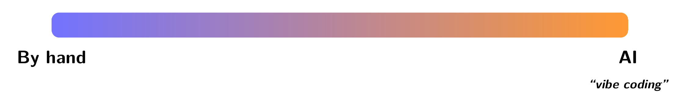
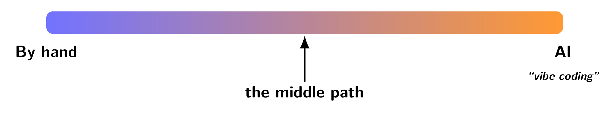
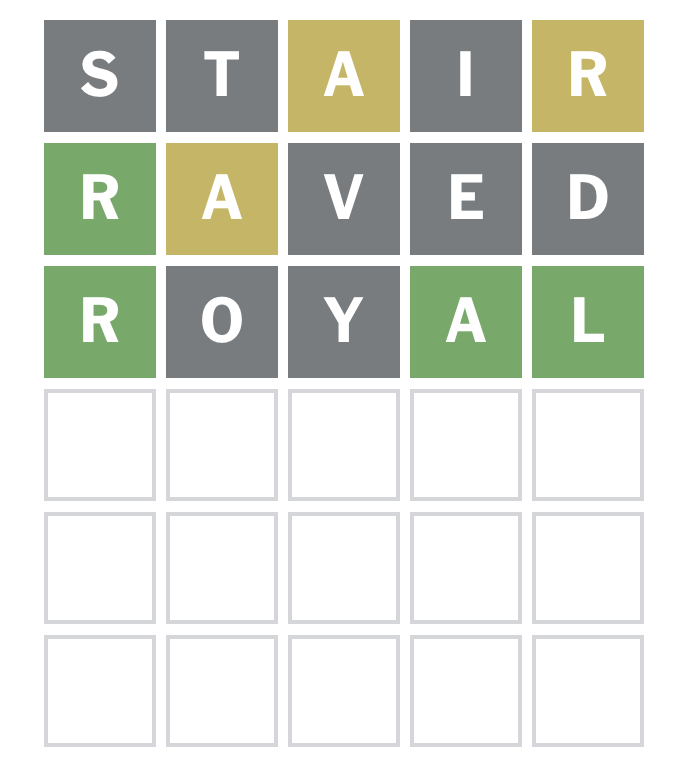

---
theme:
  path: ../../.presenterm/theme.yaml
  override:
    footer:
      style: template
      right: "{current_slide} / {total_slides}"
options:
  list_item_newlines: 2
---


Worldle
=======

To follow along, clone the course repo:

```bash
git clone https://github.com/dsc-courses/dsc190-tools-2026-sp.git
```

---

<!-- new_lines: 4 -->
<!-- alignment: center -->


**<span class="term">Coding in 2026</span>**

Coding in 2026
==============

<!-- new_lines: 4 -->
<!-- alignment: center -->




Coding in 2026
==============

<!-- new_lines: 4 -->
<!-- alignment: center -->




The Problem with Vibe Coding
============================

- Vibe coding is great for one-off scripts and utilities.
- But it can lead to a "house of cards".

Claim
=====

- Claim: coding agents are great at coding, bad at *architecting* and figuring out real-world constraints.
    - Problem: most examples we can do in a single lecture won't require much of either.
    - Hard to demonstrate cases where the coding agents struggle.
- Nevertheless, vibe coding has limits, and for non-trivial problems a more structured approach is needed.


The Middle Path
===============

- You define the architecture of your software and specify what the output should be.
- The coding agent fills in the details.

Declarative Coding
==================

- In the 1970s, computer scientists explored the idea of <span class="term">**declarative programming**</span>.
    - "Standard" programming: write code that describes **how** to achieve a result.
    - Declarative programming: write code that describes **what** the result should be. Computer figures out how to achieve it.
- *Prolog* is a famous example of a declarative programming language.
    - SQL is another.
- But these were always niche languages with limited capabilities.

Declarative Coding in 2026
==========================

- Using coding agents, we can now do something like declarative programming in mainstream languages like Python.
    1. Write function signatures that specify the inputs and outputs.
    2. Write tests that describe what the functions should do.
    3. Let AI fill in the implementation details.


---

<!-- new_lines: 4 -->
<!-- alignment: center -->


**<span class="term">Demo Project: Wordle</span>**

What is Wordle?
===============



Goal
====

A terminal app with two subcommands:

- wordle play: play a game of Wordle.
- wordle cheat: suggest good next guesses based on feedback.

Demo
====

- We'll "live code" this using a coding agent.
- **Disclaimer**: this task is **easy** -- it can be vibecoded with Claude, etc.
    - Catch-22: any task that is non-trivial for a coding agent would be too complex to demo in a single lecture.
- Nevertheless, we'll see how to do it using the "middle path".

Getting Started
===============

- Create an `AGENTS.md` (or `CLAUDE.md` for CC) with basic instructions for the coding agent.
    - Should tell it how to run the tests, install packages, etc.

Core Architecture
=================

- Any implementation of Wordle needs to be able to do two things:
    - Given a guess and a target, produce the feedback that Wordle would give.
    - Given some feedback and a guess, determine if the guess "matches" the feedback.
- Everything else builds on top of these.
- Middle path: write two function signatures and tests for these core functions, then let the coding agent fill in the implementation.
    - `construct_feedback()` and `matches_feedback()`

Demo
====
