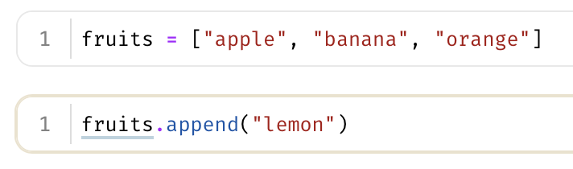
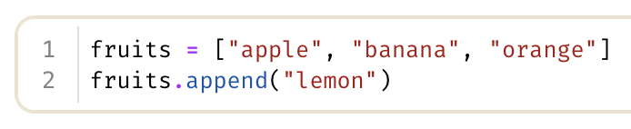

---
theme:
  path: ../../.presenterm/theme.yaml
  override:
    footer:
      style: template
      right: "{current_slide} / {total_slides}"
options:
  list_item_newlines: 2
---


Notebooks
=========

To follow along, clone the course repo:

```bash
git clone https://github.com/dsc-courses/dsc190-tools-2026-sp.git
```

---

<!-- new_lines: 4 -->
<!-- alignment: center -->


**<span class="term">Data Pipelines</span>**

Data Pipelines
==============

- In a typical data science project, we do a lot of **data processing** before we
build our model.
- Starting from the "raw data", we:
    1. Clean it
    2. Transform it
    3. Extract features
- This is a <span class="term">**data pipeline**</span>.
    - Each step is typically performed by code.

Data Pipelines
==============

- Each change you make to a processing step results in a new version of the processed data.
- Keeping the data in sync with the code can be difficult.
- DVC provides <span class="term">**data pipelines**</span> to help with this.

Idea
====

- Store the original, raw data.
- Tell DVC how to perform each step.
- DVC will automatically run the steps in the correct order, and keep track of which version of the data corresponds to which version of the code.
- Changing an earlier processing step will automatically trigger re-running of all subsequent steps.

Defining a Pipeline
===================

- Use *dvc stage add* to define a stage of the pipeline.

```bash
dvc stage add -n <stage_name> \
    -d <dependency> \
    -o <output> \
    <command>
```

- This creates/updates `dvc.yaml` with the stage information.

Running the Pipeline
====================

- Once the pipeline is defined and all stages have been added, run it with:

```bash
dvc repro
```

Demo
====

- The `01-pipeline` demo contains sample data and code for cleaning, transforming, and feature extraction.
- Define and run a pipeline with those three stages.
- Try:
    - Changing the code for one of the stages and re-running the pipeline.
    - Cloning a fresh copy of the repo and pulling data.

---

<!-- new_lines: 4 -->
<!-- alignment: center -->


**<span class="term">(What's Wrong With) Jupyter Notebooks</span>**

Jupyter Notebooks
=================

- Data scientists do much of their work in **notebooks**.
- In particular, *Jupyter Notebooks*.
- But Jupyter Notebooks have some limitations and pitfalls.

Pitfall #1: Out of Order Execution / Hidden State
=================================================

- A Jupyter notebook's result can depend on the order in which cells were executed or hidden state.
- <span class="bad">**Problem:**</span> this can lead to inconsistent/non-reproducible results.


Pimentel et al. (2019):

> Out of 863,878 attempted executions of valid notebooks (i.e., notebooks with
> defined Python version and execution order), only 24.11% executed without
> errors and only 4.03% produced the same results.

Pitfall #2: Version Control
===========================

- Jupyter notebooks are JSON files containing both code and output.
    - Images are stored as a binary blob in the notebook file.
- <span class="bad">**Problem:**</span> version controlling them with git is less-than-ideal.
    - Diffs are hard to read.
    - Merge conflicts are difficult to resolve.

Pitfall #3: Sharing
===================

- It is easy to share a *static* (un-runnable) Jupyter notebook.
- <span class="bad">**Problem**</span>: sharing a *runnable* notebook is more difficult.
    - Requires running a Jupyter server and sharing the notebook file.

Alternatives
============

- Jupyter notebooks are not the only game in town.
- Several alternatives have popped up in recent years, including:
    - **Google Colab**
    - **Observable**
    - **Marimo Notebooks**

---

<!-- new_lines: 4 -->
<!-- alignment: center -->


**<span class="term">Marimo Notebooks</span>**

Marimo
======

- Marimo notebooks are a new type of notebook designed to address some of the limitations of Jupyter notebooks.
- Install with:

```bash
uv add marimo
```
- Edit a notebook with:
```bash
marimo edit <notebook>
```


Differences
===========

- Marimo notebooks differ from Jupyter notebooks in several significant ways.

Difference 1: Order Doesn't Matter
==================================

- The order in which you execute cells in a Marimo notebook *does not matter*.
- Try it: Demo 04.


How?
====

- Marimo analyzes the notebook to determine which cells depend on which other cells.
- It then builds a *dependency graph*.
- When you execute a cell, Marimo automatically executes all cells that it depends on first.
- More similar to a spreadsheet than a script.

Gotchas
=======

- The same variable cannot be defined in two different cells.
    - Otherwise, order of execution would matter.
    - You should probably follow this rule in Jupyter Notebooks; Marimo enforces it.
- See: Demo 04, Example 04.

Tips
====

- Don't mutate the same variable in two different cells.


Bad
===



Good
====




Difference 2: Format
====================

- Marimo notebooks are simply Python files.
    - The output of each cell is *not* stored by default.
- This makes them <span class="good">**much easier**</span> to version control with git.
- Also, somewhat nicer to use AI agents with.
- Try it: Demo 05.

Difference 3: Sharing
=====================

- Marimo notebooks are trivial to share.
- Notebooks can be published as *WebAssembly* apps that run entirely in the browser.
    - I.e., the user doesn't need to install Python to run them.
- Also easier to hide code for sharing with non-technical users.

Other Nice Features
===================

- Marimo notebooks support *interactive widgets* that allow users to interact with the notebook.
- Marimo integrates well with uv, and can automatically install dependencies.

Marimo in VS Code
=================

- Marimo has a VS Code extension, similar to the Jupyter extension.
