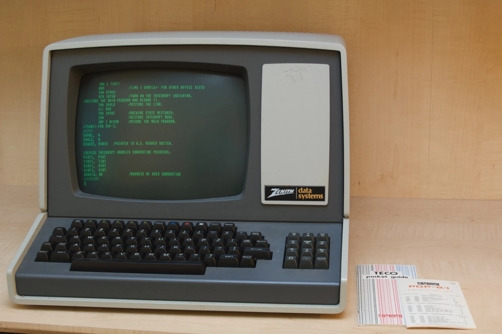

---
theme:
  path: ../../../.presenterm/theme.yaml
options:
  list_item_newlines: 2
---

<!-- new_lines: 4 -->
<!-- alignment: center -->


**<span class="term">Extra: Modern Shell</span>**

Modern Shell
============

- The tools we've been learning (bash, find, grep, *et al.*) are 30, 40, 50 years old.
<!-- list_item_newlines: 1 -->
- Today: we'll see some more *modern* replacements.
    - Nicer to use, more powerful, faster.

So why learn the old tools?
===========================

Two reasons:

<!-- list_item_newlines: 1 -->
1. They are everywhere.
    - bash, find, grep, *et al.* are on *every* Unix/Linux system.
    - The modern tools we'll see today are usually *not*.
<!-- list_item_newlines: 2 -->
2. AI agents love to use the old tools.

Today's Tools
=============

- bash -> fish
- ls -> lsd
- less -> bat
- find -> fd
- grep -> rg (ripgrep)
- ? -> fzf

All of these have been installed in the linux container.

bash
====

- There are many different shells.
- The shell we have been using is called *`bash`*
    - "Bourne Again SHell"
- It has been the default since 1989.

1989
====



fish
====

- *fish* ("Friendly Interactive SHell") is a more modern shell.
- Type "`fish`" to start it.
- Features:
    - Better auto-completion
    - Color!
    - More!

lsd
===

- lsd ("LSDeluxe") is a modern replacement for `ls`.
- Type "`lsd`" to use it.
- Features:
    - Color!
    - Icons!

bat
===

- `bat` is a modern replacement for `less` (and `cat`).
- Type "`bat <filename>`" to use it.
- Features:
    - Color!
    - Line numbers!

fd
==

- `fd` is a modern replacement for `find`.
- Type "`fd <pattern>`" to use it.
- Features:
    - Faster!
    - Simpler syntax!

```bash
fd "pattern"
# vs.
find . -name "*pattern*"
```

rg
==

- `rg` ("ripgrep") is a modern replacement for `grep`.
- Type "`rg <pattern>`" to use it.
- Features:
    - Faster!
    - Simpler syntax!

```bash
rg "pattern"
# vs.
grep -r "pattern" .
```

fzf
===

- The modern shell can be much more *interactive*.
- `fzf` is a command-line "fuzzy finder".
- Reads "choices" from standard input, and lets you interactively select one.

